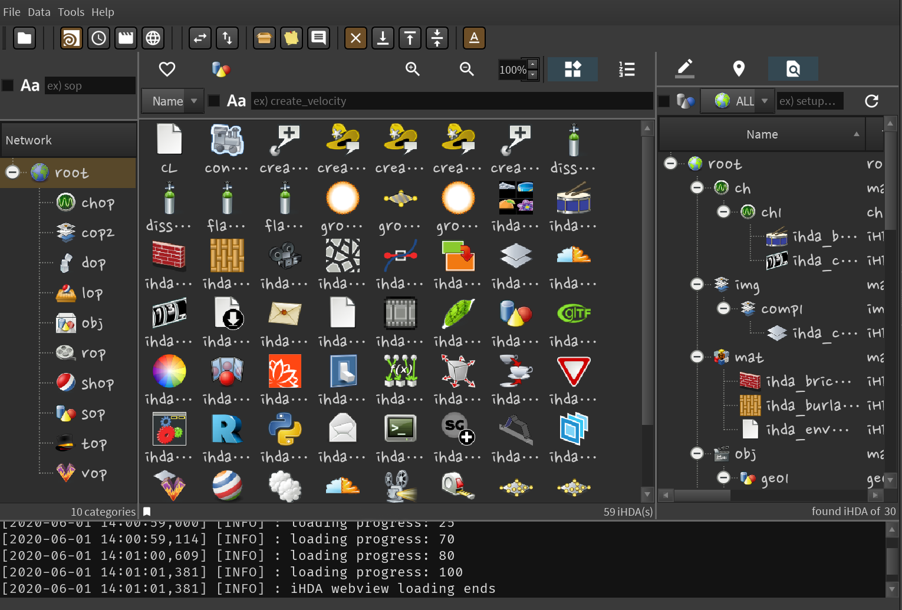

# Individual HDA

**_Houdini Version: 18.0.460 or higher is recommended._**

- [ ] Linux (Video playback and production has not been implemented yet)
- [ ] Mac (Video playback and production has not been implemented yet)
- [x] Windows (All works)

---

## SUPPORT

---

## LICENSE

MIT License

Copyright (c) 2020 Seongcheol Jeon

Permission is hereby granted, free of charge, to any person obtaining a copy
of this software and associated documentation files (the "Software"), to deal
in the Software without restriction, including without limitation the rights
to use, copy, modify, merge, publish, distribute, sublicense, and/or sell
copies of the Software, and to permit persons to whom the Software is
furnished to do so, subject to the following conditions:

The above copyright notice and this permission notice shall be included in all
copies or substantial portions of the Software.

THE SOFTWARE IS PROVIDED "AS IS", WITHOUT WARRANTY OF ANY KIND, EXPRESS OR
IMPLIED, INCLUDING BUT NOT LIMITED TO THE WARRANTIES OF MERCHANTABILITY,
FITNESS FOR A PARTICULAR PURPOSE AND NONINFRINGEMENT. IN NO EVENT SHALL THE
AUTHORS OR COPYRIGHT HOLDERS BE LIABLE FOR ANY CLAIM, DAMAGES OR OTHER
LIABILITY, WHETHER IN AN ACTION OF CONTRACT, TORT OR OTHERWISE, ARISING FROM,
OUT OF OR IN CONNECTION WITH THE SOFTWARE OR THE USE OR OTHER DEALINGS IN THE
SOFTWARE.

---

## FEATURES

- Houdini internal application that systematically manages and supervises the nodes of
  Houdini artists.

- Houdini artists can very easily register the node they are working on with mouse drag&drop
  and import the registered node into Houdini.

- Almost everything is done with automation and focuses on convenience so that Houdini artists can focus on their work.  
  Registered nodes are automatically classified by category, and icons and thumbnails are also
  created automatically.
  And various information about the node is stored.

- By default, registered nodes are managed by version and records of node registration methods
  are stored.  
  Registered nodes can quickly search for the desired node in various ways and can be
  imported into Houdini by version.

- Save the description and tag of the registered node. You can also search by tag.  
  You can also bookmark frequently used nodes and easily find and import them into Houdini.

- HIP file information of all registered nodes is recorded and you can check which iHDA node is in
  which HIP file.  
  You can search the current iHDA's location in the HIP file you are working on and do a node shortcut.

- All data information except actual data is managed in the database.  
  By introducing a proxy model between the database and the user, it maintains a pleasant environment
  and speed even when many nodes are registered.

- You can easily create videos of registered nodes with just a few clicks.
  The produced video can be viewed directly with its own built-in player.

- Web view self-support and default is Houdini help.
  Users with Internet access can work on Houdini while watching YouTube or Houdini courses.

---

- Houdini 아티스트의 노드를 체계적으로 관리하고 감독하는 Houdini 내부 응용 프로그램입니다.

- Houdini 아티스트는 마우스 드래그 앤 드롭으로 작업중인 노드를 매우 쉽게 등록하고 등록 된 노드를 Houdini로
  가져올 수 있습니다.

- 거의 모든 것이 자동화로 이루어지며 Houdini 아티스트가 작업에 집중할 수 있도록 편의성에 중점을 둡니다.  
  등록 된 노드는 범주별로 자동 분류되며 아이콘과 썸네일도 자동으로 생성됩니다.  
  그리고 노드에 대한 다양한 정보가 저장됩니다.

- 기본적으로 등록 된 노드는 버전별로 관리되며 노드 등록 방법에 대한 레코드가 저장됩니다.
- 등록 된 노드는 다양한 방법으로 원하는 노드를 빠르게 검색 할 수 있으며 버전별로 Houdini로 가져올 수 있습니다.

- 등록 된 노드의 설명과 태그를 저장하십시오. 태그별로 검색 할 수도 있습니다.  
  또한 자주 사용하는 노드를 즐겨 찾기로 설정하고 쉽게 찾아 Houdini로 가져올 수 있습니다.

- 등록 된 모든 노드의 HIP 파일 정보가 기록되며 어떤 iHDA 노드가 어떤 HIP 파일에 있는지 확인할 수 있습니다.  
  작업중인 HIP 파일에서 현재 iHDA의 위치를 검색하고 노드 바로 가기를 수행 할 수 있습니다.

- 실제 데이터를 제외한 모든 데이터 정보는 데이터베이스에서 관리됩니다.  
  데이터베이스와 사용자간에 프록시 모델을 도입하여 많은 노드가 등록 되어도 쾌적한 환경과 속도를 유지합니다.

- 몇 번의 클릭만으로 등록 된 노드의 비디오를 쉽게 만들 수 있습니다.  
  제작 된 비디오는 자체 내장 플레이어로 직접 볼 수 있습니다.

- 웹보기 자체 지원 및 기본값은 Houdini 도움말입니다.  
  인터넷에 액세스 할 수있는 사용자는 YouTube 또는 Houdini 코스를 보면서 Houdini에서 작업 할 수 있습니다.

---

- Houdini 内部应用程序，用于系统地管理和监督 Houdini 艺术家的节点。

- Houdini 艺术家可以非常轻松地通过鼠标拖放来注册他们正在处理的节点，并将注册的节点导入到 Houdini 中。

- 几乎所有事情都是通过自动化完成的，并且注重便利性，因此 Houdini 艺术家可以专注于自己的工作。  
  已注册的节点会自动按类别进行分类，并且还会自动创建图标和缩略图。并存储有关该节点的各种信息。

- 默认情况下，已注册节点由版本管理，并存储节点注册方法的记录。  
  注册的节点可以通过各种方式快速搜索所需的节点，并且可以按版本将其导入到 Houdini 中。

- 保存注册节点的描述和标签。您也可以按标签搜索。  
  您还可以为常用节点添加书签，并轻松找到它们并将其导入到 Houdini 中。

- 记录所有已注册节点的 HIP 文件信息，您可以检查哪个 iHDA 节点位于哪个 HIP 文件中。  
  您可以在正在处理的 HIP 文件中搜索当前 iHDA 的位置，并执行节点快捷方式。

- 除实际数据外，所有数据信息都在数据库中进行管理。  
  通过在数据库和用户之间引入代理模型，即使在注册了许多节点的情况下，它仍可保持令人愉悦的环境和速度。

- 只需单击几下，即可轻松创建注册节点的视频。可以使用自己的内置播放器直接观看制作的视频。

- Web 视图自我支持，默认情况下是 Houdini 帮助。可以访问互联网的用户可以在观看 YouTube 或 Houdini 课程时在 Houdini 上工作。
