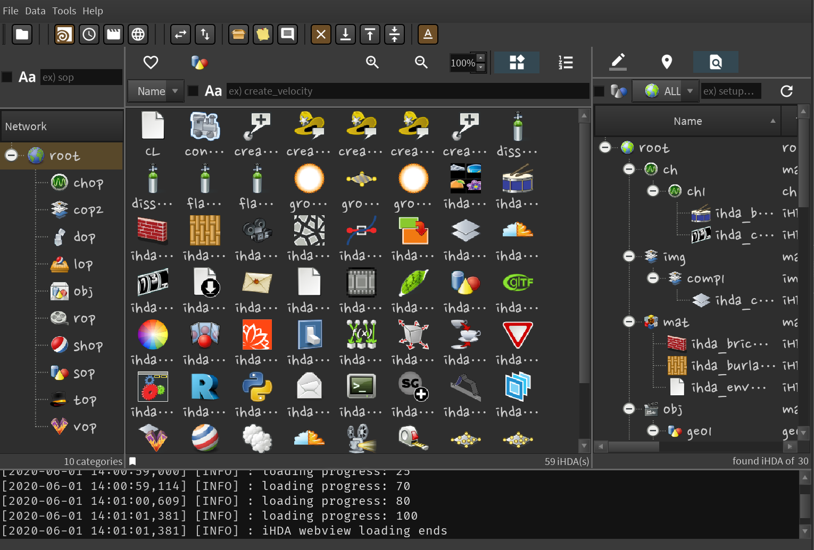

# Individual HDA

**_Houdini Version: 18.0.460 or higher is recommended._**   

> ***Friends, node drag and drop should be done with middle mouse click.   
You cannot drag and drop with the left mouse button.***

> For reference, this app is designed for personal use from the beginning. So it works as a lightweight SQLite3 DB file instead of a DB server.   
For multi-user use, stable operation is possible only by operating DB servers such as MariaDB, MySQL, and MongoDB.   
In addition, when an individual registers an asset, he must operate an API server that processes data so that it can be updated with other people's apps.
Using the iHDA app as a multi-user can cause problems.   

- [ ] Linux (Video playback and production has not been implemented yet)
- [ ] Mac (Video playback and production has not been implemented yet)
- [x] Windows (All works)

---

## SUPPORT

*If you like this app, please support it :)*   

---

## UPDATE CONTENTS

### v1.7.1
**https://github.com/seongcheoljeon/IndividualHDA/releases/tag/v1.7.1**
- Changed so that the user can select a data storage location.
- Fixed asset name change error.

---

## LICENSE

MIT License

Copyright (c) 2020 Seongcheol Jeon

Permission is hereby granted, free of charge, to any person obtaining a copy
of this software and associated documentation files (the "Software"), to deal
in the Software without restriction, including without limitation the rights
to use, copy, modify, merge, publish, distribute, sublicense, and/or sell
copies of the Software, and to permit persons to whom the Software is
furnished to do so, subject to the following conditions:

The above copyright notice and this permission notice shall be included in all
copies or substantial portions of the Software.

THE SOFTWARE IS PROVIDED "AS IS", WITHOUT WARRANTY OF ANY KIND, EXPRESS OR
IMPLIED, INCLUDING BUT NOT LIMITED TO THE WARRANTIES OF MERCHANTABILITY,
FITNESS FOR A PARTICULAR PURPOSE AND NONINFRINGEMENT. IN NO EVENT SHALL THE
AUTHORS OR COPYRIGHT HOLDERS BE LIABLE FOR ANY CLAIM, DAMAGES OR OTHER
LIABILITY, WHETHER IN AN ACTION OF CONTRACT, TORT OR OTHERWISE, ARISING FROM,
OUT OF OR IN CONNECTION WITH THE SOFTWARE OR THE USE OR OTHER DEALINGS IN THE
SOFTWARE.

---

## INSTALL

>[iHDA Install Video](https://www.youtube.com/watch?v=wbHcrlRSPdY)

1. Click the "Download ZIP" button to download. Or, if you use git, download it as git.
2. If it is compressed, decompress it.
3. Move "individualHDA.pypnal" file to your houdini python_panels directory. ex) $HOME/houdini18.0/python_panels
4. Move the "individualHDA" directory to the houdini python directory. ex) $HOME/houdini18.0/scripts/python
5. After running Houdini, launch the "Individual HDA" panel.
6. Good Luck!!

---

## FEATURES

>[iHDA Demo Video](https://www.youtube.com/watch?v=m0Mykf7oBmg)

- Houdini internal application that systematically manages and supervises the nodes of
  Houdini artists.

- Houdini artists can very easily register the node they are working on with mouse drag&drop
  and import the registered node into Houdini.

- Almost everything is done with automation and focuses on convenience so that Houdini artists can focus on their work.  
  Registered nodes are automatically classified by category, and icons and thumbnails are also
  created automatically.
  And various information about the node is stored.

- By default, registered nodes are managed by version and records of node registration methods
  are stored.  
  Registered nodes can quickly search for the desired node in various ways and can be
  imported into Houdini by version.

- Save the description and tag of the registered node. You can also search by tag.  
  You can also bookmark frequently used nodes and easily find and import them into Houdini.

- HIP file information of all registered nodes is recorded and you can check which iHDA node is in
  which HIP file.  
  You can search the current iHDA's location in the HIP file you are working on and do a node shortcut.

- All data information except actual data is managed in the database.  
  By introducing a proxy model between the database and the user, it maintains a pleasant environment
  and speed even when many nodes are registered.

- You can easily create videos of registered nodes with just a few clicks.
  The produced video can be viewed directly with its own built-in player.

- Web view self-support and default is Houdini help.
  Users with Internet access can work on Houdini while watching YouTube or Houdini courses.
