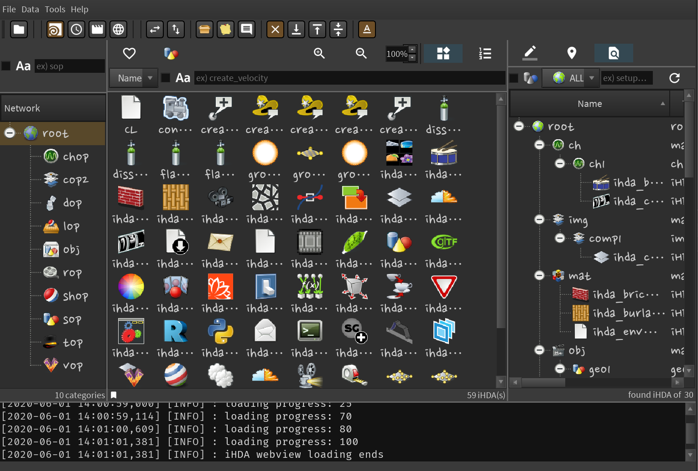

# Individual HDA

Individual HDA is a personal Houdini digital-asset library. It runs inside Houdini and keeps HDA files, versions, thumbnails, notes, tags, favorites, preview videos, and HIP-file locations together.




## Personal and team libraries

Use the library selector above the existing asset browser: **Personal** or
**Connect team…**. Team assets use the same list, search, notes and tags. Asset
operations are in the existing right-click menu; connection settings and project
membership are under **Library Tools**. No separate workspace window is used.
See [Team library setup](docs/TEAM_LIBRARY.md) for the FastAPI/PostgreSQL server.
Administrator `backup`, `verify-backup` and `restore-backup` commands create a
consistent DB/file bundle and verify recovery in an empty isolated database;
see [backup and recovery](docs/TEAM_LIBRARY.md#백업과-복구).

## Requirements

- Houdini 21 or later with Qt 6 and Python 3.11+
- A writable local directory for the library database and files
- Optional FFmpeg and ffprobe for preview videos

The application uses Houdini's bundled Python and PySide6. Do not install a second Qt or Python package into Houdini.

## Installation

Use a Houdini package so the repository stays in one location.

1. In Houdini's Python Shell, print the user preference directory:

   ```python
   import hou
   print(hou.getenv("HOUDINI_USER_PREF_DIR"))
   ```

2. Copy [`packages/IndividualHDA.json`](packages/IndividualHDA.json) to the `packages` directory inside that preference directory.

3. Set `IHDA_ROOT` in the package file to the directory containing this repository's `main.py`:

   ```json
   {
     "enable": true,
     "load_package_once": true,
     "env": [{"IHDA_ROOT": "/path/to/IndividualHDA"}],
     "hpath": "$IHDA_ROOT"
   }
   ```

   Use forward slashes in JSON paths. Examples: `C:/Users/you/tools/IndividualHDA`, `/Users/you/tools/IndividualHDA`, `/home/you/tools/IndividualHDA`.

4. Restart Houdini and open **Windows → Python Panel → Individual HDA**.

Do not copy the source or `.pypanel` file when using the package. Remove an old manually copied `individualHDA.pypanel` if it creates a duplicate panel.

## First launch

Open **Preferences** and select the directory that contains `ihda.db`, or an empty directory for a new library. Save the preference and reopen the panel.

For video features, select the FFmpeg installation or its `bin` directory. Both `ffmpeg` and `ffprobe` must be available there or on `PATH` before Houdini starts.

Settings are stored under `$HOUDINI_USER_PREF_DIR/IndividualHDA/.config`. Set `IHDA_CONFIG_DIR` to override that location.

Assets are registered under your OS login name. Set `IHDA_USER` to use a pipeline-assigned name instead. An existing local library keeps the single user it already has, so older libraries created as `anonymous` open unchanged.

## Use

- Drag a node with the middle mouse button to register it or import an asset.
- Browse categories and search by name, tag, or node type.
- Manage versions, notes, tags, favorites, thumbnails, and preview videos.
- Inspect asset instances recorded from HIP files.
- Export or import a complete library archive.
- Open the Web tab for Houdini help and web content.

The existing panel layout, menus, and interaction patterns are preserved.

## Library Tools

Open **Library Tools** in the panel menu for:

- **Health:** check database integrity, incomplete records, and missing files; export a report.
- **Backups and restore:** create named backups, validate archives, and stage a restore.
- **Repair moved paths:** preview and update stored paths after moving a library.
- **Compare versions:** compare metadata, parameter interfaces, and expanded HDA sections; import a selected version into a matching Houdini network.
- **Explorer:** search a large library in cancellable 200-row pages.
- **Recovery files:** inspect, back up, and remove unreferenced recovery files safely.

Restore and path repair close the panel after completion. Reopen it to refresh the library. See the [Library Tools guide](docs/LIBRARY_TOOLS.md) for details.

## Local AI (optional)

The panel can suggest notes and tags for an asset with a model running on your
own machine through [Ollama](https://ollama.com).

1. Install Ollama and start it (the dialog shows the command for your OS).
2. In the panel open **Tools → Local AI Models…**. The dialog recommends a
   vision-capable model for your GPU memory; press **Download**, then **Use as
   AI backend**, then **OK** in Preferences.
3. Select an asset and press the **AI** button next to the tag editor (or use
   the context menu). The suggestion fills the note and tag editors; press the
   save buttons to keep it.

Only asset metadata and the thumbnail are sent to the model, never file paths
or user names. Nothing is written to the library without your click.

Recommended models are `qwen3-vl` (4b, 8b) and `gemma4` (12b, 26b). Requests
disable model thinking, so an answer takes seconds rather than minutes; for
`qwen3-vl` the panel also sends an empty think block, because Ollama 0.34
otherwise lets the model think until its answer budget runs out. **Test
connection** in the model dialog shows load and generation time.

If the log reports that the model *spent its answer budget thinking* or
*answered only in its thinking channel*, update Ollama or choose another model
in **Tools → Local AI Models…**. A *no JSON object* error quotes the start of
the answer so you can see what the model returned.

## Data safety

The database uses SQLite schema v5 with foreign keys, validation checks, normalized tags, indexes, and transactional migrations. Existing databases are backed up before an upgrade.

File operations use a persistent journal. Imports, renames, deletions, path repairs, and restores can be recovered after an interrupted operation. Recovery copies are retained until you remove them through **Library Tools**.

Local mode is designed for a single writer. Several panels on the same machine may open one library; changes made elsewhere appear within about ten seconds or on Reload. Network filesystems and simultaneous writers from multiple machines are not supported in local mode; a server mode is planned for shared studios.

## Development

Use a separate environment; do not install development dependencies into Houdini:

```sh
python -m venv .venv
python -m pip install -r requirements-dev.txt
python -m pytest -q --cov=libs --cov=model --cov=widgets --cov-fail-under=60
python -m ruff check .
python -m ruff format --check .
python -m mypy
```

Optional: `pip install pre-commit && pre-commit install` runs the same lint and
format checks before each commit. All UI layouts are maintained Python code;
edit the screen-specific `layout.py` modules directly. See the
[UI editing guide](docs/UI_EDITING.md) for screen locations and naming conventions.
`tests/test_layouts.py` checks the actual Qt layouts and dialog behavior.

Run `git config blame.ignoreRevsFile .git-blame-ignore-revs` once so `git blame` skips the mechanical formatting commits listed in that file.

Run the Houdini smoke test with `hython`:

```sh
hython tests/houdini_smoke.py
```

It uses temporary files and a fresh Houdini process. Architecture, schema, recovery, and validation details are in [`docs/`](docs/); release decisions are in [`CHANGELOG.md`](CHANGELOG.md).

## Support

<a href="https://buymeacoffee.com/seongcheol"></a>

## License

MIT License. Copyright (c) 2020 Seongcheol Jeon. Third-party notices are in [`THIRD_PARTY_LICENSES.txt`](THIRD_PARTY_LICENSES.txt).

### Library metadata v2

`Library Tools → Trash…` restores deleted assets/versions; files remain until explicit permanent
cleanup. `Version details…` edits version descriptions and dependencies. Favorites and successful
import counts are per user. Existing personal libraries upgrade to SQLite schema 5 with a backup.
Existing team servers require a coordinated app/server upgrade and the explicit `upgrade-db`
command; see [migration and file maintenance](docs/TEAM_LIBRARY.md#데이터-기반-v2-업그레이드).
